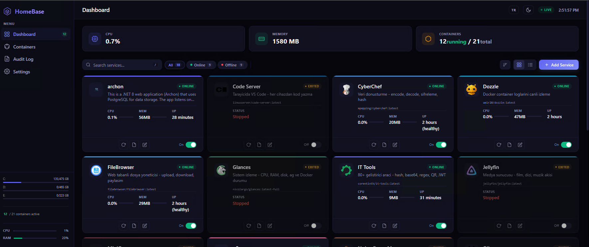
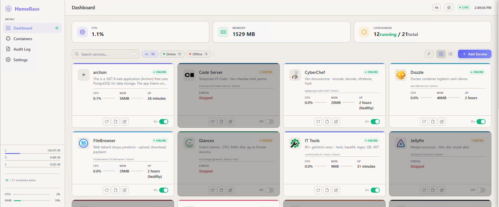
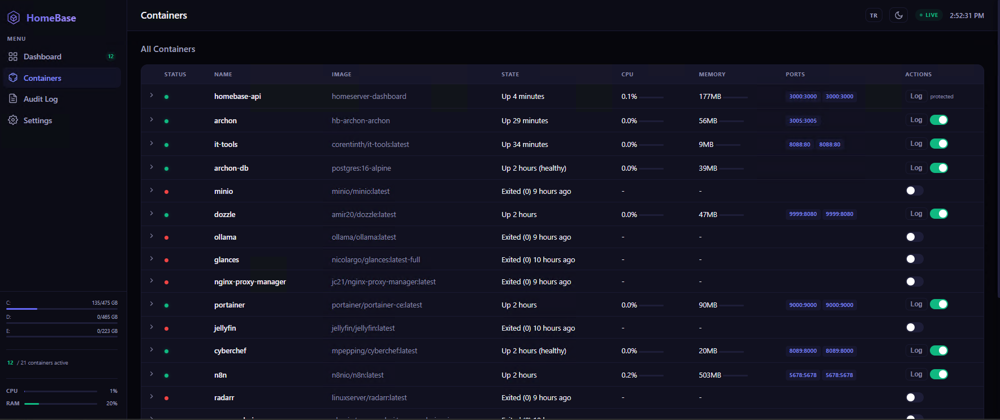
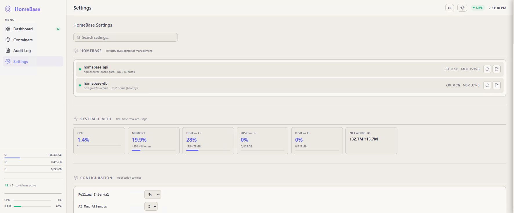
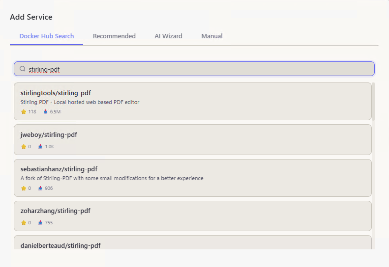
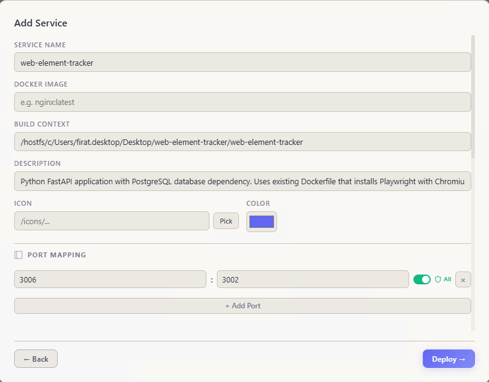
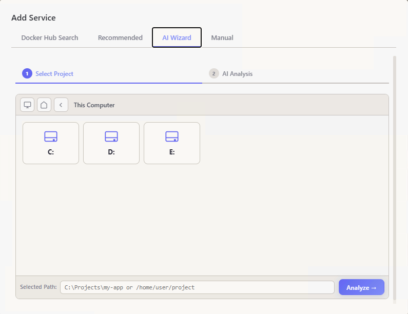

<h1 align="center">HomeBase</h1>

<p align="center">
  Self-hosted home server dashboard for managing Docker services from a single web UI.
</p>

<p align="center">
  
  
  
  
</p>

<p align="center">
  
</p>

---

## Features

- Deploy, start, stop, restart containers from the UI
- Real-time metrics via SignalR (CPU, RAM, disk, network, GPU)
- Filter by status (online/offline), category, search, and sort (name/status/CPU/memory)
- Grid and list view modes
- Dark/light theme, TR/EN language support
- Reverse proxy with port access control
- Full audit log with filters

### Deploy Methods

| Method | Description |
|---|---|
| **Docker Hub Search** | Search and deploy any image |
| **Recommended Catalog** | 35+ pre-configured services |
| **AI Wizard** | Point to a project folder, AI generates Dockerfile + Compose |
| **Manual** | Full control over image, ports, volumes, env |

### AI-Powered Deploy

- Multi-provider: OpenAI, Gemini, Claude, or custom endpoint
- Automatic failure diagnosis with multi-attempt fix loop
- Deploy chat: interact with AI to fix issues mid-deploy

---

## Screenshots

<div align="center">
  <table>
    <tr>
      <td></td>
      <td></td>
      <td></td>
      <td></td>
      <td></td>
      <td></td>
      <td></td>
    </tr>
    <tr>
      <td align="center"><b>Dashboard (Dark)</b></td>
      <td align="center"><b>Dashboard (Light)</b></td>
      <td align="center"><b>Containers</b></td>
      <td align="center"><b>Settings</b></td>
      <td align="center"><b>Docker Hub Search</b></td>
      <td align="center"><b>Add Service</b></td>
      <td align="center"><b>AI Wizard</b></td>
    </tr>
  </table>
</div>

---

## Quick Start

```bash
git clone https://github.com/firatkaanbitmez/homebase.git
cd homebase
docker compose up -d
```

Open **http://localhost:3000**

---

## Architecture

```
Browser --> ASP.NET Core 8 API --> Docker Engine (via socket)
                |                         |
                +-- SignalR Hub           +-- Container lifecycle
                +-- Static frontend      +-- Compose file management
                +-- EF Core --> Postgres  +-- AI service (multi-provider)
```

| Layer | Tech |
|---|---|
| Backend | ASP.NET Core 8, Entity Framework Core |
| Frontend | Vanilla HTML/CSS/JS (no framework) |
| Database | PostgreSQL 16 |
| Real-time | SignalR WebSocket |
| AI | OpenAI, Gemini, Claude, Custom |
| Container | Docker Engine API + Compose CLI |

---

## Project Structure

```
homebase/
├── src/HomeBase.API/
│   ├── Controllers/       # REST API
│   ├── Services/          # Docker, AI, Compose, Port Access
│   ├── Data/              # DbContext, migrations
│   ├── Models/            # Entities and DTOs
│   ├── Hubs/              # SignalR hub
│   ├── wwwroot/           # Frontend (modular JS, CSS)
│   └── Dockerfile
├── services/              # Per-service compose files
├── docker-compose.yml     # Postgres + Dashboard
└── LICENSE
```

---

## Configuration

All settings are configurable from the Settings page.

| Setting | Default | Description |
|---|---|---|
| `DASHBOARD_PORT` | `3000` | Web UI port |
| AI Provider | — | OpenAI / Gemini / Claude / Custom |
| AI Max Tokens | `4000` | Response token limit |
| AI Max Attempts | `3` | Auto-fix retry count |
| Compose Timeout | `120s` | Compose operation timeout |
| Chart History | `60` | Dashboard chart data points |
| GPU Poll Interval | `10s` | GPU info refresh rate |

---

## Keyboard Shortcuts

| Key | Action |
|---|---|
| `1` `2` `3` `4` | Switch views |
| `/` | Focus search |
| `n` | Open deploy wizard |
| `r` | Refresh |
| `t` | Toggle theme |
| `Esc` | Close modals |

---

## License

[MIT](LICENSE)
